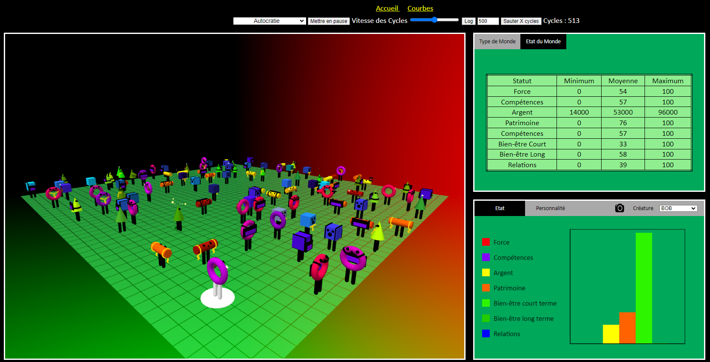
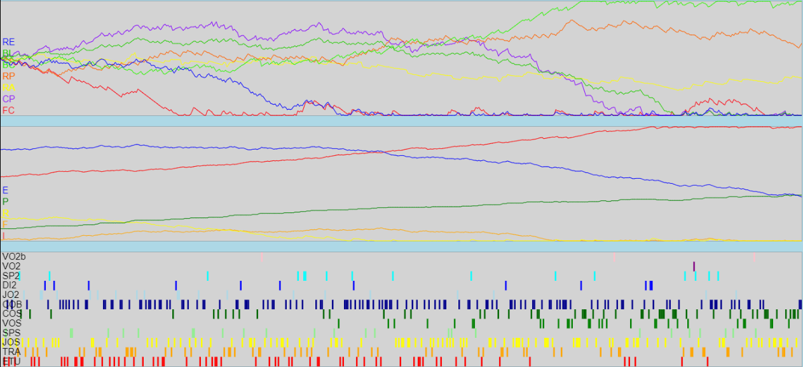
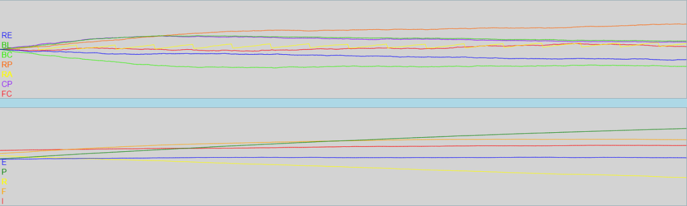

# BMWorld
 
BENE-MALE WORLD, alias BM-World, est une simulation d'un monde fictif contenant une centaine de créatures réparties sur un plateau.

Chaque créature a une personnalité et des caractéristiques qui lui sont propres. Ces caractéristiques et personnalités influencent la probabilité des actions que peuvent réaliser les créatures. Inversement, ces actions ont une répercussion sur la personnalité et les caractéristiques des créatures.
Ces actions sont de deux types :
- Les actions individuelles : Étudier, Travailler, Jouer, Faire du sport, Consommation de substances illicites, Achat de biens, Voler la société.
- Les actions à deux : Jouer, Discuter, Faire du sport, Voler un individu, Se faire voler.

Les créatures évoluent dans un monde dans lequel les règles peuvent varier. En effet, l'utilisateur peut choisir un système politique: Autocratie, Anarchie, Démocratie, Démocratie Libérale, Communisme.

Plus de détails dans ./doc/ICT-306-SI-CA1a-2023.docx

# Screenshots
## Monde

## Statistiques d'une créature
- Graphe 1 : attributs au cours du temps.
- Graphe 2 : personnalité au cours du temps.
- Graphe 3 : actions réalisées à chaque cycle.

Plus de détails dans ./doc/ICT-306-SI-CA1a-2023.docx

## Statistiques du monde (valeurs moyennes des stats des créatures)

# Auteurs
Nous sommes une classe du CPNV de Ste-Croix, en première année FPA d'informatique. Le projet a été réalisé dans le cadre d'un cours sous la supervision du professeur Jean-Philippe Chavey.
## Moteur
- BORGEAUD Maxime
- CORREIA-DA-SILVA Maikol
- OGAY Ayami
## Répresentation
- CLOT Ian
- MARTET Antoine
- WIRZ Matthieu
## Design
- MACHARD Lucas
- MIELLOT Ambre
## Comportement
- CLOT Ian
- MAURER Valentin
- AKYUZ Yasin-Salih
## Scrum Masters
- CLOT Ian
- MIELLOT Ambre